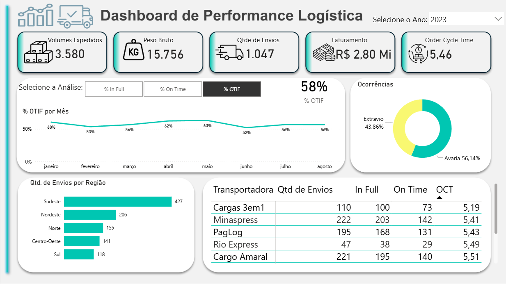

# 📊 Logistics Performance Dashboard | Power BI

Dashboard desenvolvido em Power BI para monitoramento de indicadores logísticos e análise de performance operacional.

## 🎯 Objetivo

Criar uma visualização clara dos principais indicadores da operação logística, permitindo acompanhar o desempenho das entregas, identificar atrasos e apoiar a tomada de decisão.

---

## 📈 Indicadores analisados

O dashboard permite acompanhar:

- Total de pedidos
- Entregas realizadas
- Pedidos em atraso
- Status das entregas
- Performance da operação logística
- Indicadores operacionais

---
## 📊 Dashboard Preview

---
## 🛠 Ferramentas utilizadas

- Power BI
- Power Query
- Modelagem de dados
- Análise de dados aplicada à logística

---

## 📂 Estrutura do projeto

---

## 🚀 Possíveis aplicações

Esse dashboard pode ser utilizado por:

- equipes de logística
- gestores de operações
- analistas de supply chain
- planejamento de transporte

para monitorar indicadores logísticos e melhorar a eficiência operacional.

---

## 👨‍💻 Autor

Fernando Henrique Morais  
Production Engineer | Data Analysis | Logistics & Operations
